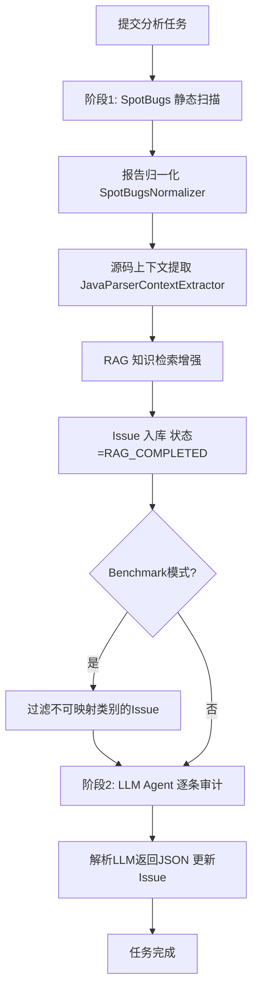
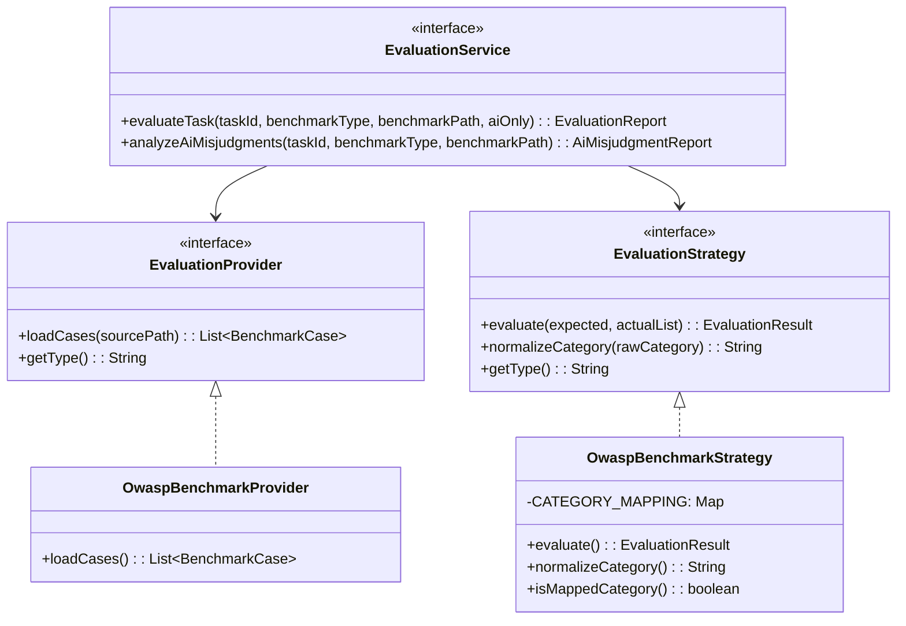

# 基于大语言模型的静态分析误报消除系统——评估体系设计与实现

## 一、系统概述

本系统（Static-LLM）是一个将传统静态分析工具（SpotBugs/FindSecBugs）与大语言模型（DeepSeek）相结合的 Java 安全漏洞审计平台。其核心思路是：先由静态分析工具扫描目标项目，产生初始的缺陷报告；再由 LLM Agent 对每条缺陷进行二次研判，判断其是否为**真实漏洞（True Positive）**还是**误报（False Positive）**，从而提升静态分析的精确率。

系统采用 Spring Boot 多模块架构，分为四层：

| 模块 | 职责 |
|---|---|
| `static-llm-common` | 通用实体、枚举、响应封装 |
| `static-llm-adapter` | 外部工具适配层（SpotBugs 命令行调用、LLM API 客户端） |
| `static-llm-core` | 核心业务逻辑（报告归一化、源码上下文提取、评估框架） |
| `static-llm-web` | Web 服务层（Controller、Service、LLM Agent、RAG 服务） |

## 二、分析流水线

整个分析过程由 `AnalysisTaskServiceImpl` 驱动，遵循以下阶段化流程：

### 2.1 阶段一：静态分析与预处理

1. **SpotBugs 静态扫描**：通过 `SpotBugsAdapter` 以命令行方式调用 SpotBugs，采用 `-effort:max -high` 参数执行最大深度、高严重性的分析，输出 XML 格式报告。系统实现了基于 JAR 文件 MD5 的**秒传缓存机制**，对相同 JAR 包跳过重复扫描。

2. **报告归一化**：`SpotBugsNormalizer` 使用 DOM4J 解析 SpotBugs XML 报告，将 `BugInstance` 节点转化为统一的 `UnifiedIssue` 数据结构，提取规则ID（`type`）、严重程度（`priority`）、文件路径、起止行号和描述信息。

3. **源码上下文提取**：`JavaParserContextExtractor` 基于 JavaParser 库，对每个 Issue 定位其所在源文件，提取：
   - **类字段声明**（Level 0）：当前类的成员变量
   - **所在方法完整体**（Level 0）：包含问题行的完整方法源码
   - **被调用方法签名**（Level +1）：一层深度的方法调用追踪

   该上下文信息被拼接到 `codeSnippet` 字段中，供后续 LLM 分析参考。

4. **RAG 知识检索增强**：对每个 Issue，系统基于 `"How to fix SpotBugs rule '{ruleId}': {message}"` 构造查询语句，通过 Chroma 向量数据库 + Ollama 嵌入模型进行语义检索，将检索到的相关安全知识追加到代码片段中，作为 LLM 的参考背景知识。

### 2.2 阶段二：LLM Agent 审计

系统使用 LangChain4j 框架构建了 `CodeAuditAgent`，配置了 DeepSeek 大语言模型和两个工具（Tool Use）：

- **readFile**：读取项目中指定源文件的完整内容
- **listDirectory**：列出项目目录结构

Agent 的系统提示词（System Prompt）详细定义了三步分析流程：

1. **理解漏洞类型**：根据 `ruleId` 识别漏洞类别（注入、XSS、路径遍历、弱加密、弱哈希、弱随机数等）
2. **读取完整上下文**：强制要求使用工具读取源文件，追踪从用户输入到危险操作的完整数据流
3. **做出判断**：基于数据流分析，判定为真实漏洞（`isFalsePositive=false`）或误报（`isFalsePositive=true`），并输出结构化 JSON

LLM 返回的 JSON 包含四个字段：`issueId`、`isFalsePositive`、`reasoning`（分析依据）、`fixSuggestion`（修复建议），系统解析后更新到数据库。

### 2.3 Benchmark 模式优化

在以 OWASP Benchmark 为评估目标时，系统提供了 `benchmarkMode` 开关。开启后，在 LLM 审计前会过滤掉**无法映射到 Benchmark 漏洞类别的 Issue**（即 `CATEGORY_MAPPING` 中不存在的 `ruleId`），避免对评估无意义的 Issue 消耗 LLM token。被跳过的 Issue 会标记为 `[SKIPPED]` 并记录原因。

## 三、评估体系设计

系统设计了一套基于 **OWASP Benchmark v1.2** 的标准化评估框架，采用策略模式实现，便于未来扩展到其他基准测试。评估体系包含**三种评估模式**，分别从不同维度衡量系统的检测效果。

### 3.1 评估框架架构

- **EvaluationProvider**：负责从数据文件加载基准测试用例（Ground Truth）。`OwaspBenchmarkProvider` 实现了对 OWASP Benchmark 的 `expectedresults-1.2.csv` 文件的解析，每行包含：测试用例名（如 `BenchmarkTest00001`）、漏洞类别（如 `sqli`）、是否为真实漏洞（`true/false`）、CWE编号。
- **EvaluationStrategy**：负责定义匹配规则和类别归一化。`OwaspBenchmarkStrategy` 维护了 SpotBugs 规则ID到 OWASP Benchmark 漏洞类别的静态映射表 `CATEGORY_MAPPING`。

### 3.2 漏洞类别映射

评估的关键在于将 SpotBugs 的细粒度规则ID归一化为 OWASP Benchmark 的粗粒度漏洞类别。系统维护的映射关系如下：

| OWASP 类别 | 中文含义 | 对应的 SpotBugs 规则 |
|---|---|---|
| `sqli` | SQL 注入 | SQL_INJECTION, SQL_INJECTION_PREPARED_STATEMENT, SQL_INJECTION_TURBINE, SQL_INJECTION_HIBERNATE, SQL_INJECTION_JDO, SQL_INJECTION_JPA, SQL_NONCONSTANT_STRING_PASSED_TO_EXECUTE, SQL_PREPARED_STATEMENT_GENERATED_FROM_NONCONSTANT_STRING |
| `cmdi` | 命令注入 | COMMAND_INJECTION, OS_COMMAND_INJECTION |
| `pathtraver` | 路径遍历 | PATH_TRAVERSAL_IN, PATH_TRAVERSAL_OUT |
| `ldapi` | LDAP 注入 | LDAP_INJECTION |
| `xpathi` | XPath 注入 | XPATH_INJECTION |
| `xss` | 跨站脚本 | XSS_REQUEST_PARAMETER_TO_SERVLET_WRITER, XSS_REQUEST_PARAMETER_TO_SEND_ERROR, XSS_SERVLET, XSS_ATTRIBUTE |
| `crypto` | 弱加密 | CIPHER_INTEGRITY, DES_USAGE, ECB_MODE, STATIC_IV, UNENCRYPTED_SOCKET, RSA_NO_PADDING, RSA_KEY_SIZE, PADDING_ORACLE |
| `hash` | 弱哈希 | WEAK_MESSAGE_DIGEST_MD5, WEAK_MESSAGE_DIGEST_SHA1, WEAK_MESSAGE_DIGEST_MD2, WEAK_MESSAGE_DIGEST_MD4 |
| `weakrand` | 弱随机数 | PREDICTABLE_RANDOM, DMI_RANDOM_USED_ONLY_ONCE |
| `securecookie` | Cookie安全 | HTTPONLY_COOKIE, SECURE_COOKIE, INSECURE_COOKIE |
| `trustbound` | 信任边界 | TRUST_BOUNDARY_VIOLATION |

无法映射的 `ruleId`（如 `DLS_DEAD_LOCAL_STORE`、`DM_DEFAULT_ENCODING` 等通用代码质量规则）不属于安全漏洞范畴，在评估时会被排除。

### 3.3 匹配判定逻辑

对于每个 Benchmark 测试用例，系统通过 `OwaspBenchmarkStrategy.isMatch()` 方法判定是否被检测到。匹配需要同时满足两个条件：

1. **文件名匹配**：实际检测出的 Issue 的 `filePath` 必须包含 Benchmark 用例的文件名（如 `BenchmarkTest00001`）
2. **类别匹配**：实际 Issue 的 `ruleId` 经过 `CATEGORY_MAPPING` 归一化后，必须与 Benchmark 用例标注的 `category` 一致

基于匹配结果和 Benchmark 标准答案，构建**混淆矩阵**的四种状态：

| | 工具检测到 (Detected) | 工具未检测到 (Not Detected) |
|---|---|---|
| **Benchmark 标注为真实漏洞** | **TP (True Positive)** — 正确检出 | **FN (False Negative)** — 漏报 |
| **Benchmark 标注为非漏洞** | **FP (False Positive)** — 误报 | **TN (True Negative)** — 正确忽略 |

### 3.4 三种评估模式

#### 模式一：全量评估（FULL）

**评估对象**：静态分析工具（SpotBugs）的原始检测结果，不经过 LLM 筛选。

**目的**：建立基线（Baseline），衡量纯 SpotBugs 在 OWASP Benchmark 上的检测能力。

**流程**：加载任务中**所有** Issue → 与 Benchmark 全部 2740 条用例逐一匹配 → 计算混淆矩阵和衍生指标。

#### 模式二：AI 筛选后评估（AI_ONLY）

**评估对象**：经过 LLM Agent 审计后，被判定为**非误报**（`isFalsePositive=false`）的 Issue 子集。

**目的**：衡量"SpotBugs + LLM"联合方案的检测效果。LLM 将原始结果中的疑似误报过滤掉，剩余的"精炼"结果再与 Benchmark 对比。

**流程**：仅加载状态为 `COMPLETED` 且 `isFalsePositive != true` 的 Issue → 与 Benchmark 逐一匹配 → 计算指标。

**核心价值**：通过对比 FULL 和 AI_ONLY 两种模式的结果，可以定量分析 LLM 对静态分析精确率的提升效果，即 LLM 过滤误报后，FP 是否有效减少、Precision 是否显著提升，同时 TP 是否被不当过滤（即 Recall 是否有所下降）。

#### 模式三：AI 误判分析（AI_MISJUDGMENT）

**评估对象**：LLM Agent 对每条 Issue 做出的"真实漏洞/误报"判定本身的正确性。

**目的**：独立评估 LLM 的研判准确率——即 LLM 的判定与 Benchmark 标准答案的一致程度。

**流程**：

1. 加载所有 AI 已分析完成的 Issue（`status=COMPLETED`）
2. 从文件路径中提取 Benchmark 测试用例名（正则匹配 `BenchmarkTest\d+`）
3. 在 Benchmark 标准答案中查找对应用例
4. 验证类别匹配（`ruleId` 归一化后与 Benchmark `category` 一致）
5. 对比 AI 判定与标准答案：
   - Benchmark 标注为真实漏洞 → AI 应判定 `isFalsePositive=false`
   - Benchmark 标注为非漏洞 → AI 应判定 `isFalsePositive=true`
6. 统计正确数、错误数，计算准确率

**错误类型分类**：

- **"AI误判为假阳性 → 实际为真实漏洞（漏报）"**：Benchmark 说是真漏洞，但 AI 判定为误报，导致真实漏洞被过滤
- **"AI未识别为假阳性 → 实际为非漏洞（误报）"**：Benchmark 说不是漏洞，但 AI 判定为真实漏洞，误报未被消除

## 四、评估指标定义

### 4.1 全量评估与 AI 筛选后评估的指标

以下指标基于混淆矩阵（TP、FP、FN、TN）计算：

#### 4.1.1 精确率（Precision）

$$Precision = \frac{TP}{TP + FP}$$

**含义**：在所有被工具/系统报告为漏洞的 Issue 中，真实漏洞所占的比例。精确率越高，说明误报越少，开发者审查报告的有效性越高。

**取值范围**：[0, 1]，当 TP + FP = 0 时，定义为 0。

#### 4.1.2 召回率（Recall / TPR）

$$Recall = \frac{TP}{TP + FN}$$

**含义**：在 Benchmark 中所有真实漏洞中，被工具/系统成功检测出的比例。召回率越高，说明漏报越少，安全覆盖越全面。

**取值范围**：[0, 1]，当 TP + FN = 0 时，定义为 0。

#### 4.1.3 F1 分数（F1 Score）

$$F1 = \frac{2 \times Precision \times Recall}{Precision + Recall}$$

**含义**：精确率与召回率的调和平均数，综合反映检测系统在精确性和完整性之间的平衡。F1 分数避免了单一指标的片面性——高精确率但低召回率（保守策略）或高召回率但低精确率（激进策略）都会导致 F1 偏低。

**取值范围**：[0, 1]，当 Precision + Recall = 0 时，定义为 0。

#### 4.1.4 OWASP Benchmark 得分（Benchmark Score）

$$BenchmarkScore = TPR - FPR = \frac{TP}{TP + FN} - \frac{FP}{FP + TN}$$

**含义**：OWASP Benchmark 项目官方定义的评分标准，衡量工具在检出真实漏洞的能力与产生误报的倾向之间的净效益。该指标同时考虑了检测能力（TPR）和误报代价（FPR），是静态分析工具在 OWASP Benchmark 数据集上的综合能力评判标准。

其中：

- **TPR (True Positive Rate)**：即召回率 Recall = TP / (TP + FN)，表示真实漏洞的检出率
- **FPR (False Positive Rate)**：误报率 = FP / (FP + TN)，表示在非漏洞样本中被错误报告为漏洞的比例

**评分解读**：

- **得分 = 1（100%）**：完美检测——检出所有真实漏洞（TPR=1），且零误报（FPR=0）
- **得分 = 0（0%）**：等同于随机猜测——TPR 与 FPR 相等，即检测能力等同于掷硬币
- **得分 < 0（负值）**：比随机猜测更差——误报率超过了真实漏洞检出率，工具产生的噪声大于有效信号
- **得分 > 0（正值）**：检测能力优于随机猜测，值越大越好

**取值范围**：[-1, 1]。

#### 4.1.5 分类别召回率（Category Recall）

系统还按漏洞类别（如 `sqli`、`xss`、`crypto` 等）分别计算召回率，反映工具在不同漏洞类型上的检测覆盖差异。这有助于发现工具的强项与短板，例如 SQL 注入检测能力强但 XSS 检测不足等。

### 4.2 AI 误判分析的指标

#### 4.2.1 AI 判定准确率（Accuracy）

$$Accuracy = \frac{CorrectCount}{MatchedCount}$$

**含义**：在所有成功匹配到 Benchmark 标准答案的 Issue 中，AI 判定与标准答案一致的比例。

**计算基数说明**：

- `TotalAnalyzed`：AI 已分析完成的 Issue 总数
- `MatchedCount`：其中能成功匹配到 Benchmark 用例的 Issue 数（需同时满足文件名匹配和类别匹配）
- `CorrectCount`：AI 判定正确的数量
- `WrongCount`：AI 判定错误的数量

准确率以 `MatchedCount` 为分母而非 `TotalAnalyzed`，因为无法匹配到 Benchmark 的 Issue 无标准答案可供验证，不应计入评估。

## 五、数据持久化

评估结果持久化到两张表中：

### 5.1 评估记录主表（evaluation_record）

存储每次评估的汇总数据：

| 字段 | 类型 | 说明 |
|---|---|---|
| `id` | BIGINT | 主键 |
| `task_id` | BIGINT | 关联的分析任务ID |
| `eval_mode` | VARCHAR(20) | 评估模式：`FULL` / `AI_ONLY` / `AI_MISJUDGMENT` |
| `tp_count, fp_count, fn_count, tn_count` | INT | 混淆矩阵四元组（FULL/AI_ONLY 模式） |
| `precision_rate, recall_rate, f1_score` | DOUBLE | 精确率/召回率/F1（FULL/AI_ONLY 模式） |
| `benchmark_score` | DOUBLE | OWASP Benchmark 得分（FULL/AI_ONLY 模式） |
| `total_analyzed, matched_count` | INT | AI 已分析总数 / 匹配数（AI_MISJUDGMENT 模式） |
| `correct_count, wrong_count` | INT | AI 正确数 / 错误数（AI_MISJUDGMENT 模式） |
| `accuracy` | DOUBLE | AI 准确率（AI_MISJUDGMENT 模式） |

### 5.2 评估详情表（evaluation_detail）

存储每次评估中的逐条对比明细：

| 字段 | 类型 | 说明 |
|---|---|---|
| `id` | BIGINT | 主键 |
| `record_id` | BIGINT | 关联的评估记录ID |
| `benchmark_test_name` | VARCHAR(100) | Benchmark 测试用例名 |
| `benchmark_category` | VARCHAR(50) | Benchmark 漏洞类别 |
| `benchmark_is_real` | TINYINT(1) | Benchmark 标注是否为真实漏洞 |
| `match_status` | VARCHAR(10) | 匹配状态：TP/FP/FN/TN（FULL/AI_ONLY 模式） |
| `ai_is_false_positive` | TINYINT(1) | AI 判定是否为误报（AI_MISJUDGMENT 模式） |
| `ai_correct` | TINYINT(1) | AI 判定是否正确（AI_MISJUDGMENT 模式） |
| `error_type` | VARCHAR(100) | 错误类型描述 |

## 六、评估实验设计

一次完整的评估实验包含以下步骤：

1. **准备阶段**：将 OWASP Benchmark v1.2 项目编译为 JAR 包，准备源码路径和标准答案 CSV 文件

2. **执行分析**：以 `benchmarkMode=true` 提交分析任务，系统自动完成 SpotBugs 扫描 → 上下文提取 → RAG 增强 → LLM 审计的全流程

3. **全量评估（FULL）**：以 `aiOnly=false` 调用评估接口，获取 SpotBugs 原始结果的基线指标

4. **AI 筛选后评估（AI_ONLY）**：以 `aiOnly=true` 调用评估接口，获取经 LLM 筛选后的指标

5. **AI 误判分析（AI_MISJUDGMENT）**：调用误判分析接口，评估 LLM 自身的判定准确率

6. **对比分析**：比较 FULL 与 AI_ONLY 的指标变化，量化 LLM 对静态分析效果的提升：

   | 指标 | 预期变化方向 | 说明 |
   |---|---|---|
   | Precision | ↑ 显著提升 | LLM 过滤掉部分 FP，分母减小 |
   | Recall | ↓ 略有下降 | LLM 可能误将少量 TP 判为误报 |
   | F1 | ↑ 整体提升 | Precision 提升幅度应大于 Recall 下降幅度 |
   | Benchmark Score | ↑ 提升 | FPR 降低带来的净收益 |

## 七、数学严谨性说明

### 7.1 指标边界条件处理

系统在所有指标计算中均处理了分母为零的边界情况：

- 当 TP + FP = 0 时（无检出结果），Precision 定义为 0
- 当 TP + FN = 0 时（Benchmark 中无真实漏洞），Recall 定义为 0
- 当 Precision + Recall = 0 时，F1 定义为 0
- 当 FP + TN = 0 时（Benchmark 中无非漏洞样本），FPR 定义为 0

### 7.2 评估完备性保证

全量评估和 AI_ONLY 评估以 **Benchmark 测试用例为遍历基准**（即以 expectedresults CSV 的每一行为单位），对每个用例判定其匹配状态。这保证了混淆矩阵的四元组之和恒等于 Benchmark 用例总数，即：

$$TP + FP + FN + TN = N_{benchmark}$$

这一性质确保了评估的完备性和指标计算的一致性。

### 7.3 AI 误判分析的采样偏差说明

AI 误判分析的准确率以 `MatchedCount` 为分母，而非 `TotalAnalyzed`。这是因为：

- 部分 Issue 无法从文件路径中提取 Benchmark 测试用例名（`skipNoTestName`）
- 部分 Issue 的 `ruleId` 无法映射到 Benchmark 类别（`skipCategoryMismatch`）
- 这些不可匹配的 Issue 缺乏标准答案，不纳入准确率计算

该设计确保了评估结果的公正性，但论文中应明确说明 MatchedCount 占 TotalAnalyzed 的比例，以透明化采样覆盖率。
